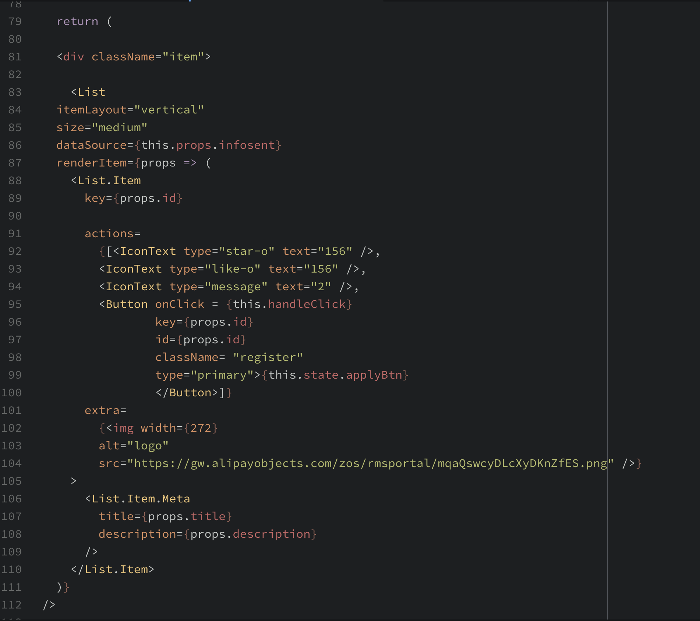

# react-express-GA-management-app
## Introduction
Bootcamp Startup is a user-friendly app to start up your own bootcamp with your choice of
courses and instructors.

## Features
- the landing page includes the school introduction, upcoming courses and user log-in option.
### Admin Story
- An intuitive control panel for Admin to perform daily administrative tasks including
browsing all courses, create courses, edit courses and delete courses.
- Admin can browse all instructors, add an instructor, edit instructors and remove instructors.
- Admin is able to browse the whole list of all students.
### Student Story
- A rich media portal for students/guests to browse course catalog, if they find
one attractive course, they can get enrolled/register.
- Students can log into their account and edit personal information in the profile page.
### Instructor Story
- An easy-to-use portal for Instructors to monitor and control the current course activities.
They are able to browse the course they teach and edit info of that specific course.
- Instructor can also see the students roster and remove student from the roll.

## Tech Specs
* React, Express, bootstrap, Sass, ES6, PostgreSQL, sequelize, webpack, npm

## WireFrames

Deployed Link:
[Bootcamp startup link](http://bootcamp_startup.surge.sh/)

## Route Structure
Route maps

Get routes that give you everything

/students  -> gives all students with
{id,fullname,email,phone,created_at,updated_at, and associated user_id}

/instructors -> gives all instructors with
{id, fullname,email,phone,title,created_at,updated_at, and associated user_id}

/courses -> gives all courses with {id,title,description,details,price,start_date,end_date,capacity,created_at,updated_at, and associated instructor_id}

Get routes that give you the values of a single member with the same values as the get all routes

/currentuser -> authenticates a user and returns a message that says logged in for the requested user

/students/:id  -> gives a student
/instructors/:id -> gives a instructor
/courses/:id -> gives a course

Delete routes
/students/:id  -> delete a student and its associated user
/instructors/:id -> delete a instructor and its associated user
/courses/:id -> delete a course

Put routes to edit any value of their type
/students/:id  -> edit a student and its associated user fullname
accepts fields of
{fullname:
phone:
email:
}
to update

/instructors/:id -> edit a instructor and its associated userfulname
accepts fields of
{fullname:
phone:
email:
}
to update

/courses/:id -> edit a course
accepts fields of
{details:
title:
description:
price:
capacity:
}
to update

Post routes that create entries
/users/students -> creates a user and a student entry, if usernames do not match
/users/instructors -> creates a user and an instructor entry. if the names dont match
/login -> logs a user in returning the fullname attribute, token, and auth_level

Special Get routes for instructor
/instructors/:id/courses -> gets courses that an instructor teaches
/instructors/:id/students -> gets students that an instructor teaches

Special Put routes to register a student to a course
/course/:id/student/:stuid

Special Delete route for Instructor
/instructors/:id/student/:studentid -> removes a student from a course and increases their capacity after they are removed

Special Put Instructor specific course edit of detail or description
/instructor/:id/course/:courseId -> edits id specified course of id specified instructor accepts fields of
{description:
details:
}
if the course is not taught by the instructor, or a course doesnt have an instructor an error will be thrown
