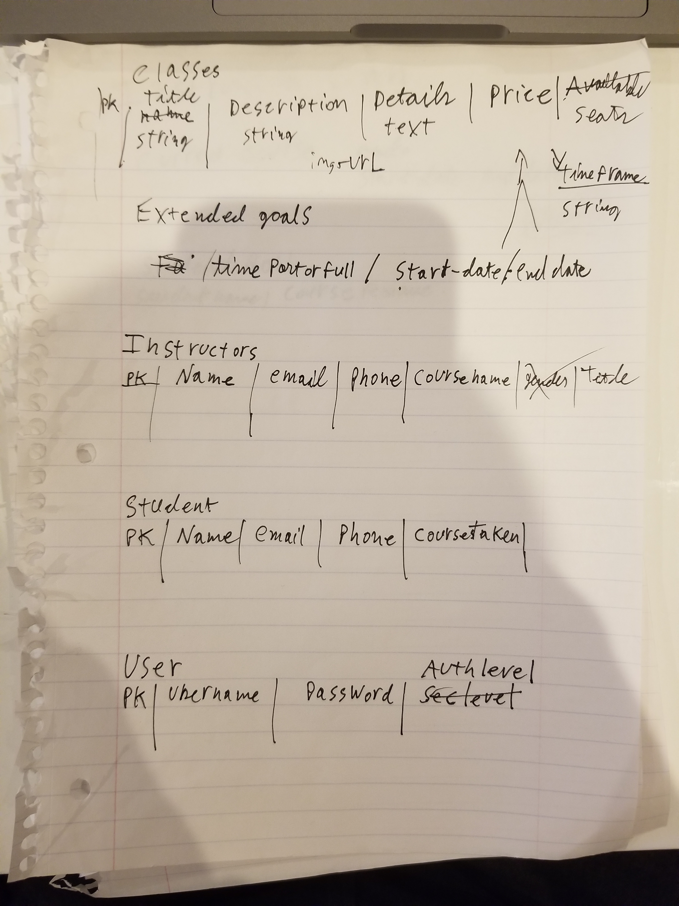
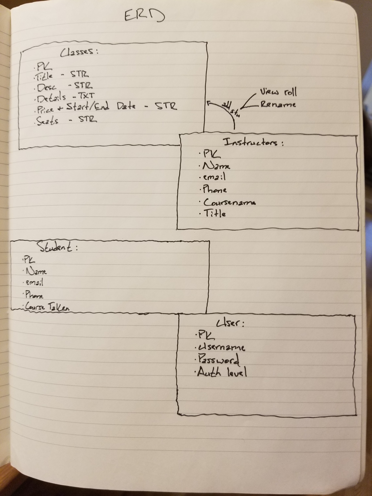
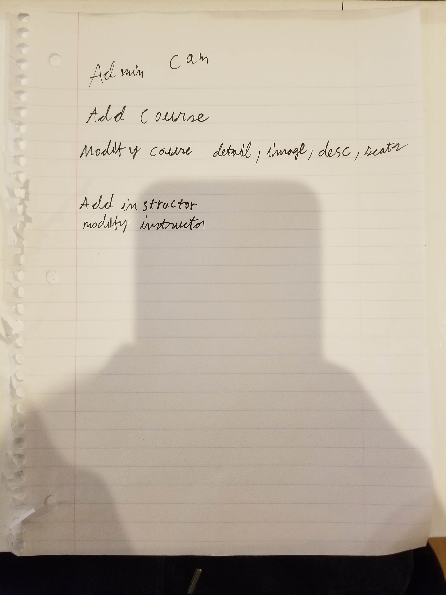
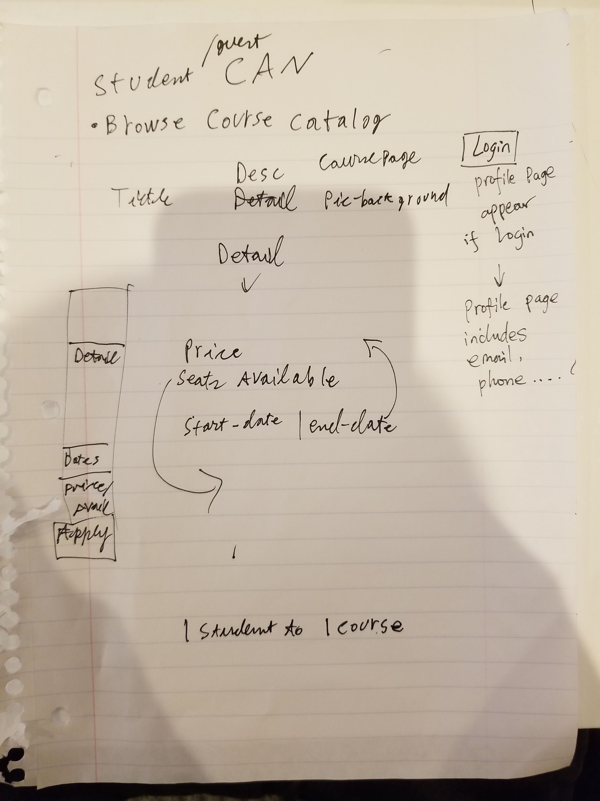

# react-express-GA-management-app
## Introduction
Bootcamp Startup is a user-friendly app to start up your own bootcamp with your choice of
courses and instructors.

## Features
- the landing page includes the school introduction, upcoming courses and user log-in option.
### Admin Story
- An intuitive control panel for Admin to perform daily administrative tasks including
browsing all courses, create courses, edit courses and delete courses.
- Admin can browse all instructors, add an instructor, edit instructors and remove instructors.
- Admin is able to browse the whole list of all students.
### Student Story
- A rich media portal for students/guests to browse course catalog, if they find
one attractive course, they can get enrolled/register.
- Students can log into their account and edit personal information in the profile page.
### Instructor Story
- An easy-to-use portal for Instructors to monitor and control the current course activities.
They are able to browse the course they teach and edit info of that specific course.
- Instructor can also see the students roster and remove student from the roll.

## Tech Specs
* React, Express, bootstrap, Sass, ES6, PostgreSQL, sequelize, webpack, npm

## WireFrames

